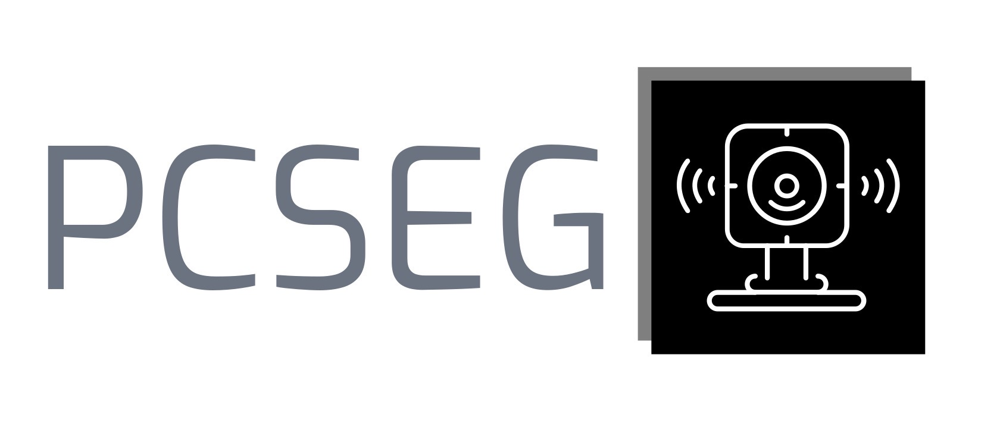

# OpenPCSeg: An Open Source Point Cloud Segmentation Codebase
[]()
[](https://github.com/PJLab-ADG/PCSeg/issues)
[](https://github.com/PJLab-ADG/PCSeg)

`OpenPCSeg` is an open-source point cloud segmentation toolbox based on [PyTorch](https://pytorch.org/), heading towards the unification and thriving of 3D scene understanding and its related areas. With the help of `OpenPCSeg`, we benchmark methods in a way that pursues fairness, efficiency, and effectiveness, on prevailing large-scale point cloud datasets. At this moment, `OpenPCSeg` focuses on outdoor point cloud segmentation for autonomous driving.

**This project is developed and maintained by Autonomous Driving Group [at] [Shanghai AI Laboratory](https://www.shlab.org.cn/) (ADLab).**


|  |  |  |
| :-: | :-: | :-: |
|  |  |  |


### Highlight
- 🌈 **Comprehensive:** We support the full spectrum of point cloud scene understanding tasks on standard large-scale benchmarks, with backbones across various 2D & 3D modalities.
- ⚖️ **Fair & Reproducible:** We unify the training, validation, and testing configurations, resulting in directly comparable 3D segmentation performance.
- 🚀 **Fast & Accurate:** Our implementations yield much better segmentation accuracy as well as training and inference speed than the originally reported results.


### Supported Task

| # | Task | Emphasis | Dataset | Method |
| :-: | :-: | :-: | :-: | :-: |
| :red_car: | Fully-Supervised LiDAR Segmentation | Accuracy | 2 | 4 |


## Changelog
- \[2023.4\] - Support sequence-wise `OpenPCSeg` inference and visualization on Waymo Open Dataset.
- \[2023.3\] - Initial release of `OpenPCSeg v1.0`.


## Upcoming Features
- Support NuScenes Dataset
- Add implementations of range-view algorithms
- Add toolbox for competition submission
- Add visualiztion of 3D segmentation results


## Outline

- [Supported Methods](#supported-methods)
- [Supported Benchmark](#supported-benchmark)
- [Model Zoo](#model-zoo)
- [Installation](#installation)
- [Data Preparation](#data-preparation)
- [Getting Started](#getting-started)
- [Visualization](#visualization)
- [Citation](#citation)
- [Authors](#authors)
- [License](#license)
- [Contact](#contact)

## Supported Methods

- [x] **[MinkowskiNet](https://github.com/NVIDIA/MinkowskiEngine)**
- [x] **[Cylinder3D](https://openaccess.thecvf.com/content/CVPR2021/papers/Zhu_Cylindrical_and_Asymmetrical_3D_Convolution_Networks_for_LiDAR_Segmentation_CVPR_2021_paper.pdf)**
- [x] **[SPVCNN](https://arxiv.org/abs/2007.16100)**
- [x] **[RPVNet](https://openaccess.thecvf.com/content/ICCV2021/papers/Xu_RPVNet_A_Deep_and_Efficient_Range-Point-Voxel_Fusion_Network_for_LiDAR_ICCV_2021_paper.pdf)**
- [ ] More to come...

## Supported Benchmark

#### LiDAR Semantic Segmentation (5)

- [x] **[SemanticKITTI](http://www.semantic-kitti.org/tasks.html#semseg)**
- [x] **[ScribbleKITTI](https://paperswithcode.com/dataset/scribblekitti)**
- [x] **[Waymo Open](https://waymo.com/open/)**
- [ ] **[A2D2](https://www.a2d2.audi/a2d2/en.html)** (coming soon)
- [ ] **[nuScenes](https://www.nuscenes.org/nuscenes)** (coming soon)

#### LiDAR Panoptic Segmentation (3)

- [ ] **[Panoptic nuScenes](https://www.nuscenes.org/panoptic)** (coming soon)
- [ ] **[Panoptic SemanticKITTI](http://www.semantic-kitti.org/tasks.html#panseg)** (coming soon)
- [ ] **[4D Panoptic SemanticKITTI](http://www.semantic-kitti.org/tasks.html#panseg4d)** (coming soon)


## Model Zoo


## Installation
Please refer to [INSTALL.md](docs/INSTALL.md) for the installation details.


## Data Preparation

```
└── data_root 
    └── nuscenes
    └── semantickitti
    └── scribblekitti
    └── waymo_open
```

Please refer to [DATA_PREPARE.md](docs/DATA_PREPARE.md) for the details to prepare the [nuScenes](https://www.nuscenes.org/nuscenes), [SemanticKITTI](http://www.semantic-kitti.org/tasks.html#semseg), [ScribbleKITTI](https://arxiv.org/abs/2203.08537), and [Waymo Open](https://waymo.com/open/) datasets.


## Getting Started
Please refer to [GET_STARTED.md](docs/GET_STARTED.md) to learn more usage about this codebase.


## Visualization
We recently supported a OpenPCSeg visualization tool for Waymo Open Dataset, please check [INFER_WAYMO.md](docs/INFER_WAYMO.md).

Here are some inference & visualization results:


## Citation
If you find this work helpful, please kindly consider citing:
```bib
@misc{openpcseg2023,
    title={OpenPCSeg: An Open Source Point Cloud Segmentation Codebase},
    author={Liu Youquan, Bai Yeqi, Kong Lingdong, Chen Runnan, Hou Yuenan, Shi Botian, Li Yikang},
    howpublished = {\url{https://github.com/PJLab-ADG/PCSeg}},
    year={2023}
}
```

## Authors
Liu Youquan, Bai Yeqi†, Kong Lingdong, Chen Runnan, Hou Yuenan, Shi Botian, Li Yikang

†Project Lead

## License
OpenPCSeg is released under the **Apache 2.0 license**, while some specific operations in this codebase might be with other licenses. Please refer to [LICENSE](docs/LICENSE) for a more careful check, if you are using our code for commercial matters.

## Contact
If you have questions about this repo, please contact Bai Yeqi (baiyeqi@pjlab.org.cn) or Shi Botian (shibotian@pjlab.org.cn).

## Acknowledgement
The overall structure of this repo is derived from [OpenPCDet](https://github.com/open-mmlab/OpenPCDet). 

Part of our implementation uses code from repositories below:
* [1] https://github.com/xinge008/Cylinder3D
* [2] https://github.com/mit-han-lab/spvnas
* [3] https://github.com/TiagoCortinhal/SalsaNext
* [4] https://github.com/open-mmlab/OpenPCDet
* [5] https://github.com/mit-han-lab/torchsparse

Thank the authors for their great work!
